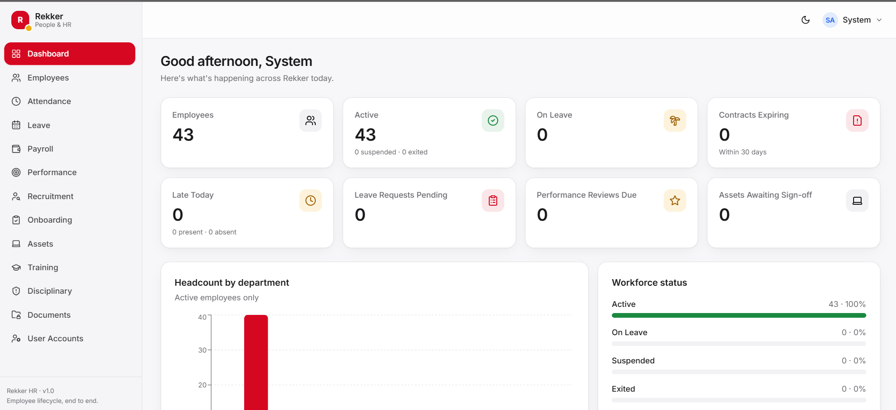

# Rekker HR

### Full-Scope Human Resources Management Platform

**Rekker HR** is a full employee-lifecycle management platform designed to centralize and streamline HR operations—from recruitment and onboarding to attendance, leave, performance, documentation, assets, training, and employee offboarding.

The project was built as a production-oriented internal business application, with an emphasis on **secure data access, role-based workflows, maintainable architecture, and a polished user experience**.

---

## What I Built

Rather than creating a simple employee database, I designed Rekker HR around the **entire employee lifecycle**.

The platform brings together:

* **Employee Management** — employee profiles, departments, roles, branches, reporting structures, employment types, contracts, emergency contacts, and next of kin.
* **Recruitment** — job openings, applicants, interview stages, shortlisting, and conversion of successful candidates into employee records.
* **Onboarding** — structured onboarding workflows covering documentation, contracts, accounts, assets, introductions, and departmental assignments.
* **Attendance** — employee check-in/out, lateness and absence tracking, with daily and historical reporting.
* **Leave Management** — leave applications, approvals, balances, approval history, and multiple leave categories.
* **Performance Management** — KPIs, goals, periodic reviews, manager assessments, improvement plans, and recognition.
* **Payroll Support** — salary structures, allowances, deductions, overtime, bonuses, advances, and structured payroll exports.
* **Asset Management** — tracking company-issued laptops, phones, SIM cards, uniforms, vehicles, tools, IDs, and asset returns.
* **Training Management** — training programs, attendance, certifications, expiry tracking, costs, and skills.
* **HR Cases** — disciplinary incidents, warnings, employee explanations, actions, and confidential HR records.
* **Document Management** — centralized employee documentation with versioning and expiry tracking.
* **HR Dashboard** — real-time operational visibility across headcount, leave, attendance, contracts, performance, assets, and other HR activities.

---

## Engineering Highlights

### Server-Side Authorization

A major focus of the project was making authorization a **backend responsibility**, rather than simply hiding UI elements from users.

Access is enforced at the API level using role-based authorization and server-side data scoping.

For example, an employee requesting data through the API cannot simply manipulate a request to retrieve another employee's records.

This approach ensures that:

> **Permissions determine what data the server returns—not what the frontend happens to display.**

The system supports multiple levels of access, including:

* Administrator
* HR
* Director
* Company-wide Manager
* Department Manager
* Employee

Department-level users can also be scoped to the employees and records belonging to their department.

---

## Document Versioning & Approval Workflow

The document system was designed around the reality that employee documents can change over time.

When an employee replaces an existing document:

1. The existing document remains active.
2. The replacement is stored as a new version.
3. The replacement enters a **Pending Review** state.
4. An authorized HR/management user can approve or reject it.
5. Rejected changes do not overwrite the active document.

This prevents employees from unintentionally or maliciously replacing official records without an approval trail.

---

## Employee Lifecycle Architecture

One of the key design decisions was connecting HR modules instead of treating them as isolated CRUD features.

A simplified lifecycle looks like:

**Recruitment → Hiring → Employee Record → Onboarding → Attendance & Leave → Performance → Training & Assets → Offboarding**

For example, hiring a candidate can transition them into an employee record and initiate the corresponding onboarding workflow.

This creates a more cohesive system than maintaining separate disconnected HR tools.

---

## Technology

### Backend

* **Node.js**
* **Express.js**
* **MongoDB**
* **Mongoose**
* **JWT Authentication**
* **Role-Based Access Control**
* **Multer**
* **ExcelJS**

### Frontend

* **React 18**
* **Vite**
* **React Router**
* **Tailwind CSS**
* **Recharts**
* **Lucide React**
* **React Hot Toast**

### Architecture

The backend follows a modular structure separating:

* Routes
* Controllers
* Models
* Middleware
* Authentication
* Business logic
* Utilities

The frontend similarly separates reusable UI components, authentication/theme contexts, API access, hooks, and feature-specific pages.

---

## Product & UI Design

The interface was designed as a modern business application rather than a traditional administrative dashboard.

Design characteristics include:

* Apple-inspired interface patterns
* Responsive layouts
* Light and dark themes
* Glass-style surfaces
* Rounded cards and components
* Contextual status colours
* Data visualization
* Reusable UI components
* Consistent navigation and interaction patterns

The design system uses Rekker's brand palette while assigning colour semantically—for example, positive states, attention states, and critical actions.

---

## Project Structure

```text
rekker-hr/
│
├── server/
│   ├── config/
│   ├── controllers/
│   ├── middleware/
│   ├── models/
│   ├── routes/
│   ├── utils/
│   └── server.js
│
├── client/
│   └── src/
│       ├── api/
│       ├── components/
│       ├── context/
│       ├── hooks/
│       └── pages/
│
└── README.md
```

---

## What This Project Demonstrates

This project reflects my approach to building software beyond individual features.

It demonstrates experience with:

**Full-Stack Development**
Designing and implementing both frontend and backend systems.

**REST API Design**
Building structured APIs around multiple interconnected business domains.

**Authentication & Authorization**
Implementing JWT authentication, role-based permissions, and server-side data isolation.

**Database Design**
Modeling interconnected HR entities and relationships using MongoDB and Mongoose.

**Business Logic**
Translating real-world HR processes into software workflows.

**Security**
Treating authorization and data access as backend concerns rather than relying on frontend restrictions.

**File & Document Management**
Handling uploads, document lifecycle management, versioning, and approval workflows.

**Data Visualization**
Turning operational data into dashboards and actionable summaries.

**Product Thinking**
Designing a system around actual organizational workflows rather than building isolated technical demonstrations.

---

## Screenshots

> 

---

## About the Project

Rekker HR was developed as part of my work building software systems for **Rekker Limited**, where I work across software development, systems, and business operations.

The project gave me the opportunity to work on a system where software architecture had to reflect real organizational processes, permissions, responsibilities, and operational requirements.

It is an example of how I approach full-stack development: **understanding the business problem first, designing the system around it, and then building the technical infrastructure required to support it.**

---

### Built with

**React · Node.js · Express · MongoDB · JavaScript · Tailwind CSS · JWT · Mongoose**
